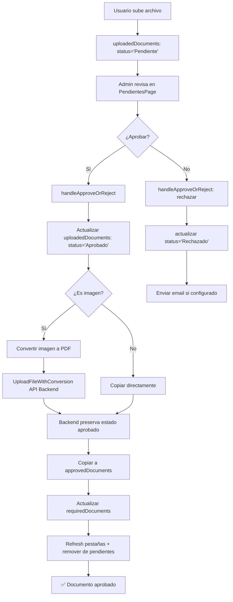

# 📋 Flujo de Aprobación de Documentos - ControlDoc v2

Este documento explica cómo funciona el sistema completo de aprobación de documentos en ControlDoc v2, incluyendo todos los procesos internos y componentes participantes.

## 🔄 Flujo General

### 1. Subida de Documento → Pendiente de Revisión
```
Usuario sube archivo → uploadedDocuments → status: "Pendiente de revisión"
```

### 2. Proceso de Aprobación
```
Admin revisa → Aprueba → Conversión (si imagen) → approvedDocuments → Actualización estado
```

## 📁 Colecciones de Firestore Involucradas

### uploadedDocuments
- **Propósito**: Documentos pendientes de revisión
- **Filtros**: Solo documentos con `status: "Pendiente de revisión"`
- **Actualizaciones**: Cuando admin aprueba/rechaza

### approvedDocuments  
- **Propósito**: Documentos aprobados y archivados
- **Creación**: Automática al aprobar documento
- **Campos**: Incluye metadata completa + historial de versiones

### requiredDocuments
- **Propósito**: Definiciones de documentos requeridos por empresa
- **Actualización**: Cuando documento se aprueba/rechaza en `approveDocument()` metadata

## ⚙️ Componentes Principales

### Frontend
- **`PendientesPage.jsx`**: Lista documentos pendientes
- **`handleApproveOrReject.jsx`**: Lógica principal de aprobación  
- **`RevisionDocumentoDialog.jsx`**: Modal para acciones admin
- **`DocumentLibraryPage.jsx`**: Smart backup y gestión

### Backend  
- **`/api/upload`**: Subida de archivos (preserva estado aprobado)
- **`/api/convert-image`**: Conversión imagen→PDF en proceso aprobación
- **MetadataService**: Gestiona estados en `requiredDocuments`

## 🔧 Proceso Detallado de Aprobación

### 1. **Inicio de Aprobación**
```javascript
// PendientesPage.jsx - Usuario hace clic "Aprobar"
handleConfirm() -> handleApproveOrReject()
```

### 2. **Validaciones Previas**
```javascript
// handleApproveOrReject.jsx líneas 54-64
if ((isAprobando || isAjustandoFecha) && !expirationDate) {
  setToastMessage('Debe ingresar una fecha de vencimiento.');
  return;
}
```

### 3. **Actualización Inicial**
```javascript
// handleApproveOrReject.jsx líneas 147-157
const updateFields = {
  status: isAprobando ? 'Aprobado' : 'Rechazado',
  reviewedAt: Timestamp.now(),
  reviewedBy: adminEmail,
  version, subversion, versionString,
  expirationDate: createSafeTimestamp(expirationDate)
};
await updateDoc(doc(db, uploadedDocumentsPath, docId), updateFields);
```

### 4. **Conversión de Imagen → PDF (si aplicable)**
```javascript
// handleApproveOrReject.jsx líneas 228-266
if (fileType?.startsWith('image/')) {
  // Llama API backend para conversión
  const response = await axios.post(conversionUrl, { imageUrl, fastMode: true });
  
  // Sube PDF convertido SIN crear nuevo documento
  const formData = new FormData();
  formData.append("file", pdfFile);
  const response = await fetch('/api/upload', { method: 'POST', body: formData });
  
  // Actualiza documento existente con PDF convertido
  updateFields.fileURL = convertedFileURL;
  updateFields.fileName = convertedFileName;
  updateFields.fileType = 'application/pdf';
}
```

### 5. **Copia a approvedDocuments**
```javascript
// handleApproveOrReject.jsx líneas 280-351
await addDoc(collection(db, approvedDocumentsPath), {
  ...data,
  ...versionData,
  status: 'Aprobado',
  expirationDate: createSafeTimestamp(expirationDate),
  originalId: docId,
  // Preserva nombre original para smart backup
  name: data.name || data.documentName,
  originalName: data.name || data.documentName
});
```

### 6. **Actualización de requiredDocuments**
```javascript
// handleApproveOrReject.jsx líneas 374-377  
if (isAprobando && data?.requiredDocumentId) {
  await approveDocument({ 
    docId: data.requiredDocumentId, 
    expirationDate, 
    user 
  });
}
```

### 7. **Actualización de Lista Local**
```javascript
// handleApproveOrReject.jsx líneas 370-371
setDocuments(prev => prev.filter(doc => doc.id !== docId));
```

## 🛡️ Protecciones Implementadas

### Backend - Preservación de Estado Aprobado
```javascript
// backend/routes/upload.js líneas 183-196
const shouldPreserveStatus = existingData.status === 'Aprobado' || 
                           existingData.reviewedAt || 
                           existingData.reviewedBy;

if (shouldPreserveStatus) {
  delete docData.status;
  delete docData.reviewedAt; 
  delete docData.reviewedBy;
  delete docData.version;
  delete docData.versionString;
}
```

### Frontend - Preservación de Nombre Original
```javascript
// handleApproveOrReject.jsx líneas 316-318
name: data.name || data.documentName || 'Sin nombre',
documentName: data.documentName || data.name || 'Sin nombre', 
originalName: data.name || data.documentName || 'Sin nombre',
```

## 📋 Smart Backup - Agrupación Inteligente

### Problema Identificado
- Timestamps en nombres rompían agrupación
- Documentos no agrupaban versiones correctamente
- Backup creaba duplicados

### Solución Implementada
```javascript
// DocumentLibraryPage.jsx líneas 379-396
const getSmartGroupKey = (doc) => {
  // Usa originalName como prioridad para agrupamiento
  const documentName = doc.originalName || doc.name || doc.documentName || 'SinNombre';
  
  return [
    doc.companyName || 'SinEmpresa',
    documentName, // ← Nombre original sin timestamp
    entityTypeText,
    doc.entityName || 'SinEntidad'
  ].join('-');
};
```

### Backend - Grouping Intelligence
```javascript
// backend/utils/generateMonthlyBackup.js líneas 50-54
const documentName = data.originalName || data.name || data.documentName || 'documento';
acc[companyName][data.entityType][entityName][documentName] = ...
```

## 🚀 Mejoras de Performance

### 1. Refresco de Pestañas
```javascript
// handleApproveOrReject.jsx líneas 398-405  
if (triggerRefresh && typeof triggerRefresh === 'function') {
  triggerRefresh('historial');
  triggerRefresh('dashboard'); 
  triggerRefresh('library');
  triggerRefresh('approved');
  triggerRefresh('pendientes');
}
```

### 2. Remoción Inmediata de Lista
```javascript
// Solo para aprobaciones: remover inmediatamente después del proceso completo
setDocuments(prev => prev.filter(doc => doc.id !== docId));
```

### 3. Estados de Carga
```javascript
// PendientesPage.jsx
const [isSubmitting, setIsSubmitting] = useState(false);
// Deshabilitar botones durante procesamiento
<Button disabled={isSubmitting}>Aprobar</Button>
```

## ⚠️ Debugging y Troubleshooting

### Logs Críticos
```javascript
console.log('🔄 Actualizando documento en uploadedDocuments:', docId, updateFields);
console.log('✅ Estado después de copiar a approvedDocuments:', status);
console.log('📋 Consulta pendientes - Documentos encontrados:', count);
```

### Errores Comunes Resueltos
1. **Estado revertido**: Backend preservaba estado aprobado
2. **Documento no desaparecía**: Sync correcto entre colecciones  
3. **Smart backup roto**: Preservación de nombre original

## 🔐 Consideraciones de Seguridad

### Validaciones Administraticas
```javascript
// Solo admins pueden aprobar
if (!adminRole) throw new Error('Unauthorized');
```

### Preservación de Estados Críticos
```javascript
// No sobrescribir en conversión/upload
const preserveStatus = ['Aprobado', 'Rechazado'];
```

## 📊 Estados de Documento

| Estado | Descripción | Colección | Acción |
|--------|--------------|-----------|---------|
| `"Pendiente de revisión"` | Recién subido | `uploadedDocuments` | Revisar |
| `"Aprobado"` | Aprobado por admin | `approvedDocuments` | Archivado |
| `"Rechazado"` | Rechazado por admin | `uploadedDocuments` | Re-subir |

## 🎯 Workflows Específicos

### Imagen → PDF + Aprobación
1. Usuario sube imagen → `uploadedDocuments` 
2. Admin aprueba → Convierte a PDF → Actualiza `uploadedDocuments`
3. Copia metadata a `approvedDocuments` 
4. Actualiza `requiredDocuments`
5. Remueve de lista pendiente

### PDF Directo + Aprobación  
1. Usuario sube PDF → `uploadedDocuments`
2. Admin aprueba → Copia directa a `approvedDocuments`
3. Actualiza estados documentadamente
4. Sync completo

### Rechazo + Notificación
1. Admin rechaza → Estado + comentario en `uploadedDocuments`  
2. Email automático si configuración habilitada
3. Documento queda en pendientes para nueva subida

---

## 🏗️ Arquitectura Técnica del Flujo



---

**Última actualización**: Septiembre 2025  
**Autor**: Sistema ControlDoc v2

