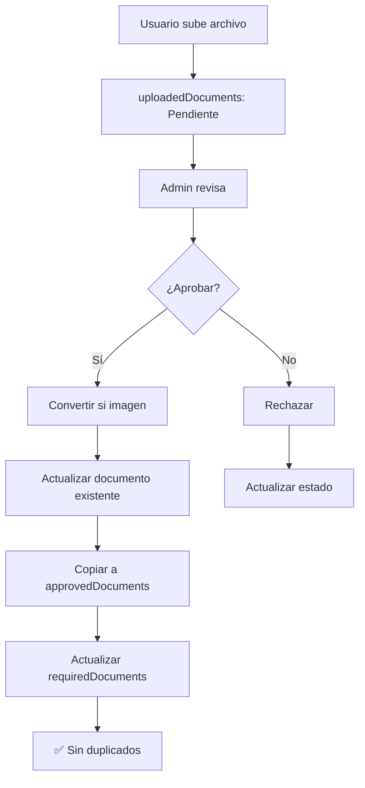

# 📚 ControlDoc v2 - Documentación Completa

Este directorio contiene toda la documentación técnica del sistema ControlDoc v2, un sistema complejo de gestión de documentos empresariales.

## 📋 Documentos Disponibles

### **1. [FLUJO_APROBACION_DOCUMENTOS.md](./FLUJO_APROBACION_DOCUMENTOS.md)**
- **Propósito**: Explica el flujo completo de aprobación de documentos
- **Contenido**: 
  - Proceso paso a paso de aprobación
  - Colecciones de Firestore involucradas
  - Componentes frontend y backend
  - Protecciones implementadas
  - Smart backup y agrupación inteligente

### **2. [SISTEMA_VERSIONES_Y_TIMESTAMPS.md](./SISTEMA_VERSIONES_Y_TIMESTAMPS.md)**
- **Propósito**: Explica el sistema complejo de versiones y timestamps
- **Contenido**:
  - Arquitectura del sistema de versiones
  - Control de duplicados
  - Eliminación selectiva de versiones
  - Prevención de documentos duplicados
  - Casos de uso específicos

### **3. [SUPERADMIN_REGISTRATION.md](./SUPERADMIN_REGISTRATION.md)**
- **Propósito**: Proceso de registro de superadministradores
- **Contenido**: Flujo de registro y configuración inicial

### **4. [PERSONALIZACION_TEMA_Y_VISTAS_AVANZADAS.md](./PERSONALIZACION_TEMA_Y_VISTAS_AVANZADAS.md)**
- **Propósito**: Documentar la personalización visual, la vista avanzada del dashboard y los nuevos formularios administrativos.
- **Contenido**:
  - Uso del selector de colores y recalculo dinámico del tema
  - Habilitación y características de la vista avanzada
  - Indicadores de estado revisados
  - Flujos de creación/gestión de documentos requeridos para admins

### **5. [MIGRACION_CLIENTES_Y_SCRIPTS.md](./MIGRACION_CLIENTES_Y_SCRIPTS.md)**
- **Propósito**: Documentar el sistema de migración de documentos a clientes y los scripts de gestión disponibles.
- **Contenido**:
  - Estructura de datos (appliesTo, clientId)
  - Scripts de migración y gestión de clientes
  - Flujos de trabajo para migraciones
  - Ejemplos de uso y solución de problemas
  - Scripts: createClient, copyCompanyData, assignDocumentsToClientsByName, migrateDocumentsToClient, etc.

### **6. [ARQUITECTURA_CLIENTES.md](./ARQUITECTURA_CLIENTES.md)** ⭐ NUEVO
- **Propósito**: Documentar la arquitectura completa del sistema de clientes y subempresas.
- **Contenido**:
  - Conceptos clave: `companyId`, `mainCompanyId`, `activeCompanyId`, `clientId`
  - Estructura de datos y relaciones
  - Flujos de trabajo completos
  - Implementación técnica (hooks, componentes)
  - Mejores prácticas y patrones de código
  - Reglas y resumen de comportamiento

### **7. [CHANGELOG_CLIENTES.md](./CHANGELOG_CLIENTES.md)** ⭐ NUEVO
- **Propósito**: Registrar cambios y mejoras realizadas al sistema de gestión de clientes.
- **Contenido**:
  - Correcciones implementadas (Diciembre 2024)
  - Mejoras técnicas y patrones establecidos
  - Problemas resueltos
  - Documentación creada

## 🎯 Conceptos Clave del Sistema

### **Arquitectura Multi-Tenant**
- **Tenants**: Organizaciones independientes
- **CompanyId**: Identificador único por empresa
- **EntityId**: Identificador único por empleado/entidad

### **Sistema de Versiones**
- **Version**: Número principal (1, 2, 3...)
- **Subversion**: Número de rechazos (0.1, 0.2, 0.3...)
- **VersionString**: Formato legible ("1.0", "2.1", etc.)

### **Control de Duplicados**
- **Documentos de ejemplo**: Filtrados con `companyId != null`
- **Conversión de imágenes**: Actualiza documento existente
- **Timestamps únicos**: Evita nombres duplicados

## 🔧 Flujos Principales

### **1. Subida de Documento**
```
Usuario → uploadedDocuments (Pendiente) → Admin revisa → Aprobar/Rechazar
```

### **2. Aprobación de Imagen**
```
Imagen → Conversión a PDF → Actualizar documento → Copiar a approvedDocuments
```

### **3. Aprobación de PDF**
```
PDF → Mantener original → Actualizar documento → Copiar a approvedDocuments
```

### **4. Rechazo después de Aprobar**
```
Documento aprobado → Eliminar última versión → Actualizar estados
```

## 🏗️ Colecciones de Firestore

### **requiredDocuments**
- **Propósito**: Plantillas globales de documentos requeridos
- **Características**: Sin `companyId`, para todas las empresas
- **Actualización**: Cuando se aprueba un documento específico

### **uploadedDocuments**
- **Propósito**: Documentos subidos por usuarios
- **Características**: Con `companyId` específico
- **Estados**: "Pendiente de revisión", "Aprobado", "Rechazado"

### **approvedDocuments**
- **Propósito**: Documentos aprobados archivados
- **Características**: Copia de documentos aprobados con metadatos completos
- **Uso**: Historial, backup, auditoría

## 🚀 Mejoras Implementadas

### **1. Prevención de Duplicados**
- ✅ Filtrado de documentos de ejemplo
- ✅ Actualización de documento existente (no creación)
- ✅ Nombres de archivo sin timestamps duplicados

### **2. Sistema de Versiones Robusto**
- ✅ Control de versiones numérico
- ✅ Timestamps para identificación única
- ✅ Eliminación selectiva de versiones

### **3. Performance Optimizada**
- ✅ Consultas filtradas
- ✅ Sincronización en tiempo real
- ✅ Estados de carga

## ⚠️ Consideraciones Técnicas

### **Seguridad**
- Validaciones de roles administrativos
- Preservación de estados críticos
- Control de acceso por tenant

### **Performance**
- Consultas optimizadas con filtros
- Sincronización eficiente
- Estados de carga para UX

### **Mantenimiento**
- Logs detallados para debugging
- Documentación actualizada
- Casos de uso específicos

## 🔍 Debugging y Troubleshooting

### **Logs Críticos**
```javascript
console.log('🔄 Actualizando documento en uploadedDocuments:', docId, updateFields);
console.log('✅ Imagen convertida a PDF, subida y URL actualizada.');
console.log('📋 Consulta pendientes - Documentos encontrados:', count);
```

### **Verificación de Estado**
```javascript
// Verificar que la actualización se aplicó
const verifySnap = await getDoc(doc(db, uploadedDocumentsPath, docId));
if (verifySnap.exists()) {
  const updatedData = verifySnap.data();
  console.log('✅ Verificación post-actualización:', updatedData);
}
```

## 📊 Métricas y Monitoreo

### **Estados de Documento**
| Estado | Descripción | Colección | Acción |
|--------|--------------|-----------|---------|
| `"Pendiente de revisión"` | Recién subido | `uploadedDocuments` | Revisar |
| `"Aprobado"` | Aprobado por admin | `approvedDocuments` | Archivado |
| `"Rechazado"` | Rechazado por admin | `uploadedDocuments` | Re-subir |

### **Flujo de Aprobación**


## 🎯 Próximos Pasos

1. **Monitoreo continuo** del sistema de versiones
2. **Optimización** de consultas complejas
3. **Documentación** de nuevos casos de uso
4. **Testing** de escenarios edge case

---

**Última actualización**: Noviembre 2024  
**Autor**: Sistema ControlDoc v2  
**Estado**: ✅ Documentación completa y actualizada
