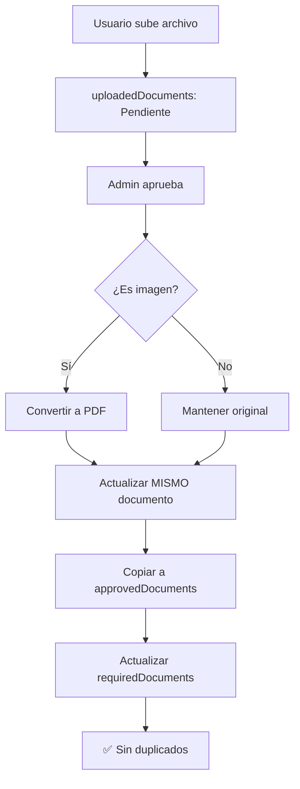

# 🕒 Sistema de Versiones y Timestamps - ControlDoc v2

Este documento explica el sistema complejo de versiones, timestamps y control de documentos duplicados en ControlDoc v2.

## 🎯 Propósito del Sistema

### **¿Por qué necesitamos timestamps y versiones?**
1. **Control de versiones**: Identificar cuál es la versión más reciente
2. **Eliminación selectiva**: Al rechazar, eliminar solo la última versión
3. **Auditoría completa**: Trazabilidad de todos los cambios
4. **Prevención de duplicados**: Evitar documentos duplicados al aprobar

## 🏗️ Arquitectura del Sistema

### **1. Colecciones de Firestore**

```
requiredDocuments/          # Plantillas globales (sin companyId)
├── documento-madre         # Para todas las empresas
    └── status: "Aprobado"  # Cuando se aprueba

uploadedDocuments/          # Documentos específicos por empresa
├── documento-empresa-A     # companyId: "A", entityId: "empleado1"
    └── status: "Aprobado" + PDF convertido

approvedDocuments/          # Documentos aprobados archivados
├── documento-empresa-A     # companyId: "A", entityId: "empleado1"
    └── PDF convertido + metadatos completos
```

### **2. Flujo de Estados**



## 🔧 Sistema de Versiones

### **Estructura de Versiones**

```javascript
// Aprobación: Incrementa versión principal
version: prevVersion + 1,        // 1 → 2 → 3
subversion: 0,                  // Siempre 0 en aprobaciones
versionString: "2.0"            // Versión limpia

// Rechazo: Incrementa subversión
version: prevVersion,           // Mantiene 2
subversion: prevSubversion + 1, // 0 → 1 → 2
versionString: "2.1"            // Subversión
```

### **Identificación de Última Versión**

```javascript
// DocumentLibraryPage.jsx - getLatestDocuments()
const key = [doc.companyId, doc.entityType, doc.entityName, doc.name].join('||');

// Compara versiones numéricas
if (docVersion > currVersion) {
  map.set(key, doc); // Esta es más nueva
}

// Si hay empate, usa timestamp
if (docVersion === currVersion) {
  if (docDate > currDate) {
    map.set(key, doc); // Esta es más reciente
  }
}
```

## 🕒 Sistema de Timestamps

### **¿Por qué timestamps además de versiones?**

**Escenarios donde SÍ es necesario:**

1. **Múltiples aprobaciones en el mismo día:**
```
Documento A: version 1.0 - 2025-01-15 10:00
Documento A: version 2.0 - 2025-01-15 10:05  ← Mismo día, diferente hora
```

2. **Aprobaciones simultáneas:**
```
Usuario 1 aprueba: version 1.0 - 10:00:00.123
Usuario 2 aprueba: version 1.0 - 10:00:00.124  ← Mismo segundo, diferente milisegundo
```

3. **Rechazos múltiples:**
```
Aprobado: version 2.0 - 10:00
Rechazado: version 2.1 - 10:01
Rechazado: version 2.2 - 10:02  ← Mismo día, diferentes momentos
```

### **Campos de Timestamp**

```javascript
// En cada documento
{
  versionTimestamp: Timestamp,    // Cuándo se creó esa versión
  reviewedAt: Timestamp,         // Cuándo se revisó
  uploadedAt: Timestamp,        // Cuándo se subió
  copiedAt: Timestamp           // Cuándo se copió a approvedDocuments
}
```

## 🚫 Prevención de Duplicados

### **Problema Identificado**

**Antes (problemático):**
1. Usuario sube imagen → `uploadedDocuments` (documento A)
2. Admin aprueba → **Crea** `uploadedDocuments` (documento B) ❌
3. Actualiza documento A a "Aprobado"
4. Documento B queda "Pendiente de revisión" ❌

**Después (correcto):**
1. Usuario sube imagen → `uploadedDocuments` (documento A)
2. Admin aprueba → **Actualiza** documento A con PDF convertido ✅
3. Copia a `approvedDocuments` con PDF convertido ✅
4. **NO se crea documento duplicado** ✅

### **Solución Implementada**

```javascript
// handleApproveOrReject.jsx - Conversión de imagen
if (fileType?.startsWith('image/')) {
  // 1. Convertir imagen a PDF
  const response = await axios.post(conversionUrl, { imageUrl, fastMode: true });
  
  // 2. Subir PDF convertido SIN crear nuevo documento
  const formData = new FormData();
  formData.append("file", pdfFile);
  const response = await fetch('/api/upload', { method: 'POST', body: formData });
  
  // 3. Actualizar documento existente con PDF convertido
  updateFields.fileURL = convertedFileURL;
  updateFields.fileName = convertedFileName;
  updateFields.fileType = 'application/pdf';
  
  // 4. Actualizar MISMO documento
  await updateDoc(doc(db, uploadedDocumentsPath, docId), updateFields);
}
```

## 🎯 Filtrado de Documentos de Ejemplo

### **Problema: Documentos sin companyId**

Los documentos de ejemplo (subidos por admins) aparecían en las listas porque tenían `companyId: null`.

### **Solución: Filtros en todas las consultas**

```javascript
// PendientesPage.jsx, AdminDashboard.jsx, HistorialPage.jsx
const query = query(
  collection(db, uploadedDocumentsPath),
  where('status', '==', statusToQuery),
  where('companyId', '!=', null) // ← Excluir documentos de ejemplo
);
```

## 🔄 Eliminación Selectiva de Versiones

### **Al rechazar después de aprobar**

```javascript
// handleApproveOrReject.jsx - Eliminación de última versión
const approvedDocsQuery = query(
  collection(db, approvedDocumentsPath),
  where('originalId', '==', docId),
  where('status', '==', 'Aprobado')
);

// Encontrar la última versión
let latestDoc = approvedDocsSnapshot.docs[0];
let latestVersionNumber = latestDoc.data().versionNumber || 0;
let latestTimestamp = latestDoc.data().versionTimestamp?.toDate?.() || new Date(0);

for (const approvedDoc of approvedDocsSnapshot.docs) {
  const docData = approvedDoc.data();
  const versionNumber = docData.versionNumber || 0;
  const timestamp = docData.versionTimestamp?.toDate?.() || new Date(0);
  
  // Si tiene mayor versionNumber O mismo versionNumber pero más reciente
  if (versionNumber > latestVersionNumber || 
      (versionNumber === latestVersionNumber && timestamp > latestTimestamp)) {
    latestDoc = approvedDoc;
    latestVersionNumber = versionNumber;
    latestTimestamp = timestamp;
  }
}

// Eliminar solo la última versión
await deleteDoc(latestDoc.ref);
```

## 📊 Nombres de Archivo y Timestamps

### **Problema: Nombres duplicados con timestamps**

**Antes:**
```
documento_1758934478335_1758934478586.pdf  ← Doble timestamp
```

**Después:**
```
documento_1758934478335.pdf  ← Timestamp único
```

### **Solución: Eliminar timestamp duplicado**

```javascript
// handleApproveOrReject.jsx - Conversión de imagen
// ANTES (con timestamp duplicado):
const cleanOriginalName = cleanFileName(originalName).replace(/\.[^/.]+$/, '');
const sanitizedName = `${cleanOriginalName}_${Date.now()}.pdf`;

// DESPUÉS (sin timestamp duplicado):
const cleanOriginalName = originalName.replace(/\.[^/.]+$/, ''); // Solo quitar extensión
const sanitizedName = `${cleanOriginalName}.pdf`;
```

## 🎯 Casos de Uso Específicos

### **1. Aprobación de Imagen**
```
1. Usuario sube: "foto.png" → uploadedDocuments
2. Admin aprueba → Convierte a PDF
3. Actualiza MISMO documento: "documento.pdf" + status: "Aprobado"
4. Copia a approvedDocuments con PDF convertido
5. Actualiza requiredDocuments (madre)
```

### **2. Aprobación de PDF**
```
1. Usuario sube: "documento.pdf" → uploadedDocuments
2. Admin aprueba → Mantiene PDF original
3. Actualiza MISMO documento: status: "Aprobado"
4. Copia a approvedDocuments con PDF original
5. Actualiza requiredDocuments (madre)
```

### **3. Rechazo después de Aprobar**
```
1. Documento ya aprobado en approvedDocuments
2. Admin rechaza → Elimina SOLO última versión
3. Actualiza uploadedDocuments: status: "Rechazado"
4. Actualiza requiredDocuments: subversion++
```

## ⚠️ Consideraciones Importantes

### **1. Documento Madre (requiredDocuments)**
- **SÍ, sigue ahí** para todas las empresas
- Es la **plantilla global** que usan todos
- Se actualiza con `status: "Aprobado"` cuando se aprueba
- **NO se duplica** en `uploadedDocuments`

### **2. Sincronización en Tiempo Real**
- Los cambios se reflejan inmediatamente
- No hay problemas de caché
- Filtros funcionan correctamente

### **3. Performance**
- Una sola consulta por colección
- Filtros optimizados
- Sin duplicados innecesarios

## 🔍 Debugging y Troubleshooting

### **Logs Críticos**
```javascript
console.log('🔄 Actualizando documento en uploadedDocuments:', docId, updateFields);
console.log('✅ Imagen convertida a PDF, subida y URL actualizada.');
console.log('✅ Documento copiado a colección global: approvedDocuments');
```

### **Verificación de Estado**
```javascript
// Verificar que la actualización se aplicó
const verifySnap = await getDoc(doc(db, uploadedDocumentsPath, docId));
if (verifySnap.exists()) {
  const updatedData = verifySnap.data();
  console.log('✅ Verificación post-actualización:', {
    docId,
    status: updatedData.status,
    reviewedAt: updatedData.reviewedAt,
    reviewedBy: updatedData.reviewedBy
  });
}
```

---

**Última actualización**: Septiembre 2025  
**Autor**: Sistema ControlDoc v2  
**Estado**: ✅ Implementado y funcionando
